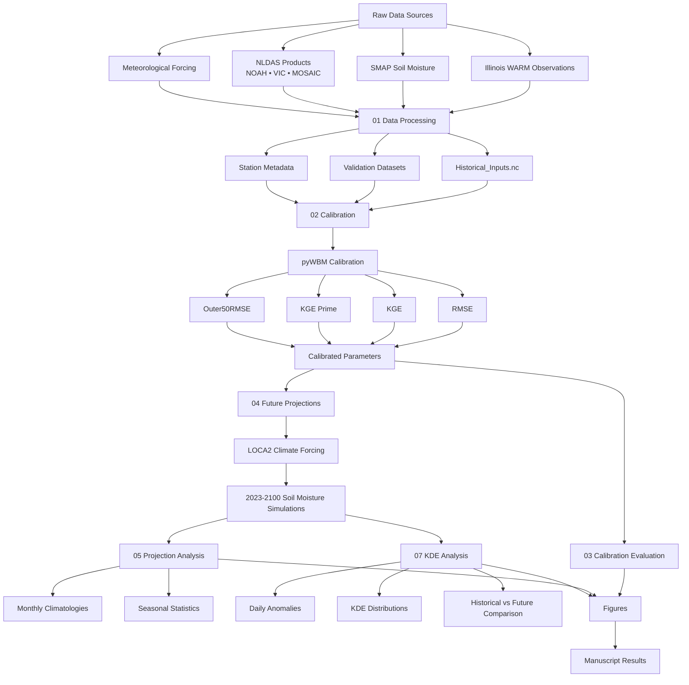

# Illinois Soil Moisture Projections using pyWBM

## Overview

This repository contains the code, workflows, and analysis used to investigate calibration-dependent uncertainty in historical and future soil moisture projections across Illinois.

The framework is built around the Python Water Balance Model (pyWBM), calibrated using multiple soil moisture datasets and evaluated using several objective functions. Future projections are generated using LOCA2 downscaled climate projections and analyzed for changes in seasonal soil moisture behavior, drought characteristics, and distributional shifts.

---




## Repository Structure

```text
.
├── data/
│   ├── Calibration/
│   ├── Historical_Inputs.nc
│   ├── inputs_by_station_noleap.nc
│   ├── Insitu_soilMoist_daily_noleap_full_years.nc
│   ├── SMAP_validation.nc
│   ├── NOAH_validation.nc
│   ├── VIC_validation.nc
│   ├── MOSAIC_validation.nc
│   ├── stations.xlsx
│   └── processed_* outputs
│
├── notebooks/
│   ├── 01. Data Processing.ipynb
│   ├── 02. Calibration.py
│   ├── 03. Calibration Plots.ipynb
│   ├── 04. Projection.py
│   ├── 05. Projection.ipynb
│   ├── 06. Projection Plots.ipynb
│   ├── 07. KDE.py
│   └── SLURM scripts
│
├── src/
│   ├── water_balance_jax.py
│   ├── prediction.py
│   ├── initial_params.py
│   ├── param_bounds.py
│   └── param_names.py
│
├── plots/
│   ├── manuscript figures
│   └── supplementary figures
│
├── tables/
│   └── calibration summary tables
│
└── slurm/
    └── HPC job logs
```

---

## Workflow

### Step 1: Data Processing

Notebook:

```text
01. Data Processing.ipynb
```

Processes and harmonizes:

* Illinois WARM soil moisture observations
* SMAP soil moisture
* NLDAS products (NOAH, VIC, MOSAIC)
* Meteorological forcing datasets

Outputs include:

```text
Historical_Inputs.nc
inputs_by_station_noleap.nc
Insitu_soilMoist_daily_noleap_full_years.nc
```

---

### Step 2: Model Calibration

Scripts:

```text
02. Calibration.py
02. Calibration.slurm
```

For each station, pyWBM is calibrated against:

* In-situ observations
* SMAP
* NOAH
* VIC
* MOSAIC

Objective functions include:

* RMSE
* KGE
* KGE′
* Outer50RMSE

Outputs:

```text
data/Calibration/
```

containing calibrated parameters and performance metrics.

---

### Step 3: Calibration Evaluation

Notebook:

```text
03. Calibration Plots.ipynb
```

Generates:

* Time series comparisons
* Calibration performance summaries
* Parameter distributions
* Supplementary analyses

---

### Step 4: Future Projections

Scripts:

```text
04. Projection.py
04. Projection.slurm
```

Uses calibrated parameters together with LOCA2 climate forcing to simulate future soil moisture.

Projection period:

```text
2023–2100
```

Scenarios:

* SSP245
* SSP370
* SSP585

Outputs include station-level projection NetCDF files.

---

### Step 5: Projection Analysis

Notebook:

```text
05. Projection.ipynb
```

Processes future simulations and computes:

* Monthly climatologies
* Seasonal statistics
* Long-term changes
* Projection summaries

Outputs stored in:

```text
processed_projection_stats_*
```

---

### Step 6: Projection Visualization

Notebook:

```text
06. Projection Plots.ipynb
```

Produces manuscript-quality figures showing:

* Seasonal cycles
* Future soil moisture changes
* Precipitation changes
* Calibration-dependent uncertainty

---

### Step 7: Daily Anomaly and KDE Analysis

Scripts:

```text
07. KDE.py
08. KDE.slurm
```

Computes:

* Daily soil moisture anomalies
* Kernel density estimates (KDEs)
* Historical versus future distributions
* Seasonal anomaly comparisons

Outputs stored in:

```text
processed_daily_anomaly_kde_*
```

---

## Calibration Datasets

### Observational

* Illinois WARM Network (in-situ observations)

### Satellite

* SMAP

### Land Surface Models

* NOAH
* VIC
* MOSAIC

---

## Future Climate Forcing

Future simulations use LOCA2 downscaled CMIP6 climate projections.

The workflow supports multiple:

* General Circulation Models (GCMs)
* Shared Socioeconomic Pathways (SSPs)

---

## Software Requirements

Major dependencies:

```text
python >= 3.11
numpy
pandas
xarray
jax
optax
scipy
matplotlib
netCDF4
h5netcdf
tqdm
```

Installation:

```bash
pip install -e .
```

or

```bash
uv sync
```

---

## Running the Workflow

### Calibration

```bash
python notebooks/02.\ Calibration.py
```

or

```bash
sbatch notebooks/02.\ Calibration.slurm
```

### Projections

```bash
python notebooks/04.\ Projection.py
```

or

```bash
sbatch notebooks/04.\ Projection.slurm
```

### KDE Analysis

```bash
python notebooks/07.\ KDE.py
```

or

```bash
sbatch notebooks/08.\ KDE.slurm
```

---

## Notes

* Most analyses assume a no-leap calendar.
* Soil moisture is expressed in millimeters of root-zone storage.
* Projection workflows were developed on the Keeling HPC cluster at the University of Illinois Urbana-Champaign.
* File paths may need adjustment for local installations.

---


## Author

Tahsina Alam

Department of Civil and Environmental Engineering

University of Illinois Urbana-Champaign

Advisor: Ryan L. Sriver
